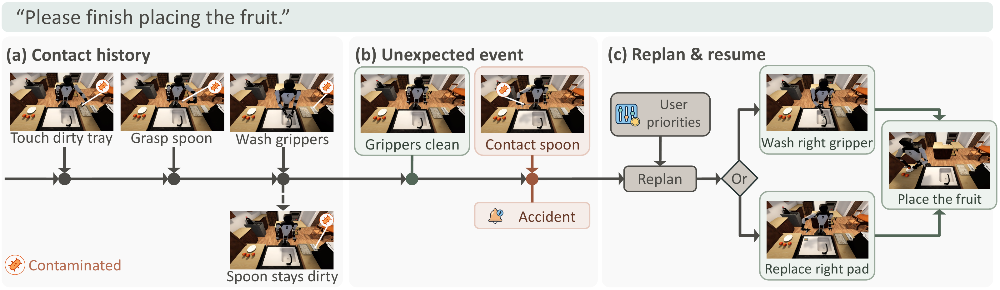
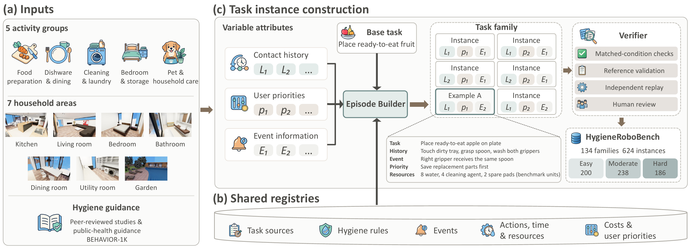
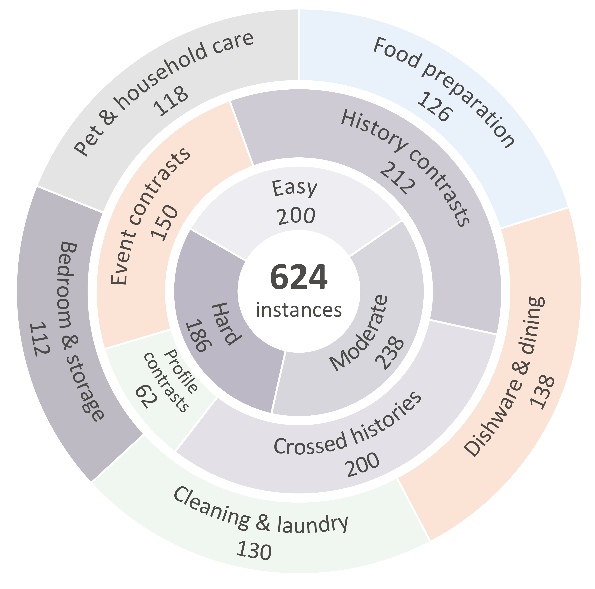

<h1 align="center">HygieneRoboBench: Benchmarking Hygiene-Aware Planning for Household Robots</h1>

<p align="center">
Yurun Chen<sup>1,2</sup>, Josh Qixuan Sun<sup>3</sup>, Jason Qin<sup>4</sup>, Chengtai Li<sup>2,5,7</sup>,<br />
Tianyi Wang<sup>2,6</sup>, Mark Crowley<sup>3</sup>, Wentao Zhu<sup>2,7</sup>
</p>

<p align="center">
<sup>1</sup> Shanghai Jiao Tong University, <sup>2</sup> Eastern Institute of Technology, Ningbo, <sup>3</sup> University of Waterloo<br />
<sup>4</sup> Stony Brook University, <sup>5</sup> University of Science and Technology of China<br />
<sup>6</sup> Chengdu Institute of Computer Applications, Chinese Academy of Sciences, <sup>7</sup> Ningbo Institute of Digital Twin
</p>

<p align="center">
  <a href="docs/assets/manuscript.pdf"></a>
  <a href="https://euron-zc.github.io/HygieneRoboBench/"></a>
  <a href="#paper-and-citation"></a>
  <a href="https://www.youtube.com/watch?v=lHuMwe2h5wo"></a>
</p>

<p align="center">
  <a href="#benchmark-overview">Overview</a> | <a href="#results">Results</a> | <a href="#resources">Resources</a> | <a href="#release-plan">Release plan</a> | <a href="#contact">Contact</a>
</p>

**TL;DR:** A household robot’s next safe action depends on what it touched before. HygieneRoboBench evaluates safe, cost-optimal task continuations under contact history, user priorities, and newly revealed contact events.



Contact with a contaminated tray transfers risk through the left gripper to a spoon handle. Washing the grippers leaves the spoon contaminated; touching it again contaminates the right gripper. Before arranging fruit, a planner must select a suitable treatment according to the task conditions and the user's priorities. The simulation scenes illustrate the benchmark's task-defined hygiene conditions.

## Benchmark overview

**624 instances | 134 task families | 5 activity groups | 7 household areas**

Each instance provides a household request, physical observations, contact history, remaining resources, event information, user priorities, and applicable shared definitions. A planner submits the remaining actions and their schedules. An independent evaluator checks task completion, hygiene, scheduling, resource constraints, and costs.



Tasks adapt BEHAVIOR-1K activities. Five shared registries define task sources, hygiene rules, events, actions and resources, and costs and user priorities. Controlled comparisons vary contact history, priorities, or event information within a task family.

<p align="center">
  
</p>

## Results

The paper evaluates seven planners on all 624 instances. **Safe Resolution (SR)** measures whether the remaining task is safely resolved under the task constraints. **Optimal Safe Resolution (OSR)** additionally requires the certified optimal cost vector under the user's priority order. Correct rejection of certified infeasibility counts toward both metrics.

| Planner | SR (%) | OSR (%) |
|---|---:|---:|
| GPT-5.6-Sol | 78.5 | 76.9 |
| GPT-5.6-Luna | 46.6 | 37.0 |
| Gemini 3.6 Flash | 89.7 | 86.1 |
| DeepSeek-V4.1-Flash | 90.7 | 75.0 |
| MiniMax-M3 | 67.0 | 57.2 |
| Rule-SAT | 30.9 | 30.0 |
| **Hygiene-NSP** | **94.4** | **90.4** |

Safe completion and user-priority optimality distinguish different aspects of planning. The companion planner **Hygiene-NSP** combines language grounding, contact-history reconstruction, and constraint solving to jointly plan hygiene treatment and task execution.

### Controlled history swaps

The evaluation exchanges histories across 180 relevant-history pairs and 92 irrelevant-history pairs in both directions, while keeping saved actions and schedules fixed. Across seven planners, none of the **1,699** originally safe, optimal plan evaluations retained both properties under relevant-history swaps. Another **15** evaluations became safe and optimal after relevant-history swaps. All **1,288** irrelevant-history swap evaluations preserved their original safety and optimality outcomes. This comparison tests the distinction between relevant and irrelevant contact-history changes.

## Resources

### Paper and citation

[**Read the paper (PDF, 9 pages)**](docs/assets/manuscript.pdf)

The manuscript contains the formal authors and affiliations, benchmark definitions, methods, and complete reported results. The arXiv link will be added when the public record is available.

Until then, the manuscript can be cited as a preprint:

```bibtex
@unpublished{chen2026hygienerobobench,
  title = {HygieneRoboBench: Benchmarking Hygiene-Aware Planning for Household Robots},
  author = {Chen, Yurun and Sun, Josh Qixuan and Qin, Jason and Li, Chengtai and Wang, Tianyi and Crowley, Mark and Zhu, Wentao},
  year = {2026},
  note = {Preprint},
  url = {https://github.com/Euron-ZC/HygieneRoboBench}
}
```

Citation metadata is also available in [CITATION.cff](CITATION.cff).

### Project page

[**Visit the project page ↗**](https://euron-zc.github.io/HygieneRoboBench/)

### Videos

[Research introduction on YouTube](https://www.youtube.com/watch?v=lHuMwe2h5wo): the motivating case, benchmark construction, controlled evaluations, results, and companion planner.

## Release plan

We are preparing the code and data for release through this repository. Updates will be announced here.

## Contact

For questions about the benchmark or its release, contact [Yurun Chen](mailto:euron.zc@gmail.com).
